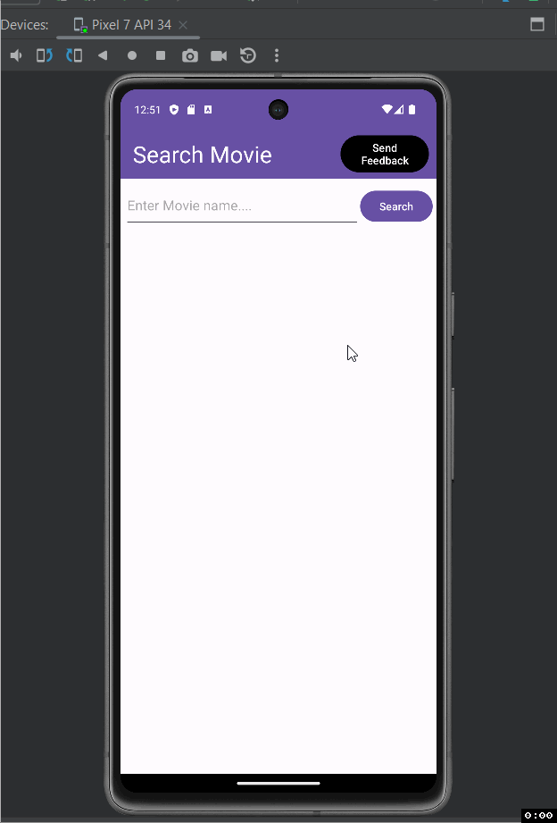

Movie Search Application

Description of the project ...

- The Project is a movie searching application that uses retrofit to send a request to the omdb api which will return an object that is the movie and the necessary movie information is returned and displayed to the user.

## Functionality 

The following **required** functionality is completed:

* [ ] Uses Retrofit to send request and receive it 
* [ ] Parsing JSON object
* [ ] Displaying data
* [ ] Using Glide to display image
* [ ] Launching implicit intents
* [ ] Toolbar menu and listener
* [ ] Application does not crash
* [ ] Appropriate comments
* [ ] README.md

The following **extensions** are implemented:

* Retrofit
* Glide
* OMDb API

## Video Walkthrough

Here's a walkthrough of implemented user stories:

GIF created with [LiceCap](http://www.cockos.com/licecap/).

## Notes

Describe any challenges encountered while building the app.

- Understanding, using, and implementing the database.

## License

    Copyright [yyyy] [name of copyright owner]

    Licensed under the Apache License, Version 2.0 (the "License");
    you may not use this file except in compliance with the License.
    You may obtain a copy of the License at

        http://www.apache.org/licenses/LICENSE-2.0

    Unless required by applicable law or agreed to in writing, software
    distributed under the License is distributed on an "AS IS" BASIS,
    WITHOUT WARRANTIES OR CONDITIONS OF ANY KIND, either express or implied.
    See the License for the specific language governing permissions and
    limitations under the License.
